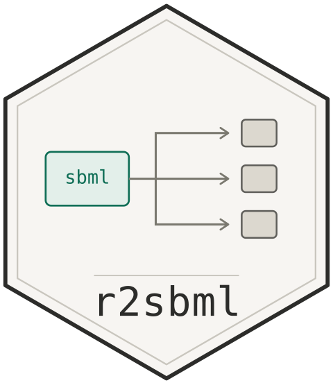

# r2sbml 

<!-- badges: start -->
[](https://github.com/sn248/r2sbml/actions/workflows/R-CMD-check.yaml)
<!-- badges: end -->

A lightweight R interface to the [libSBML](https://sbml.org/software/libsbml/) library, built with Rcpp.

`r2sbml` reads an [SBML](https://sbml.org) model, lets you query its components from R — species, parameters, compartments, reactions, rules, events, function definitions — and exports the mass balances as ready-to-simulate code for several ODE solvers.

Modifying an imported model from R is not supported: `r2sbml` reads and exports, it does not edit.

## Installation

libSBML is **bundled with the package** and built from source during installation, so you do not need to install it yourself and the build itself downloads nothing. What you do need is a C++ compiler, CMake, and the libxml2 and bzip2 headers.

```sh
# Ubuntu / Debian
sudo apt-get update && sudo apt-get install -y cmake libxml2-dev libbz2-dev

# macOS
brew install cmake libxml2
```

On Windows everything required comes with Rtools; there are no extra steps.

Then, from R:

```r
# install.packages("remotes")
remotes::install_github("sn248/r2sbml")
```

The first build takes several minutes, because libSBML is compiled from source.

## Reading a model

Most functions take a model pointer, which `getModel()` returns:

```r
library(r2sbml)

sbml_file <- system.file("examples", "sbmlsimple.xml", package = "r2sbml")
model     <- getModel(sbml_file)

getSpeciesTable(model)
#>   Number Name ID InitialConcentration InitialAmount Compartment CompartmentVol
#> 1      1       E                  NaN         5e-21        comp          1e-14
#> 2      2       S                  NaN         1e-20        comp          1e-14
#> 3      3       P                  NaN         0e+00        comp          1e-14
#> 4      4      ES                  NaN         0e+00        comp          1e-14
#>   BoundaryCondition Constant
#> 1                 0    FALSE
#> ...
```

Functions that return data:

| Function | Returns |
| --- | --- |
| `getSpeciesTable()`, `getParameterTable()`, `getReactionTable()` | a `data.frame` |
| `getSpeciesNames()`, `getCmtNames()` | a character vector |
| `getSpeciesIC()`, `getCmtSizes()` | a numeric vector |
| `getNumSpecies()` | an integer |

Functions that print to the console and return `0` invisibly — capture them with `capture.output()` rather than assigning them:

| Function | Prints |
| --- | --- |
| `getRuleMath()` | assignment, rate and algebraic rules |
| `getReactionMath()` | kinetic laws |
| `getFunctionDefinition()` | function definitions |
| `getEventMath()` | event triggers, delays and assignments |
| `printSBML()`, `echoSBML()` | the document itself |

```r
model <- getModel(system.file("examples", "sbmlassignmentrules.xml", package = "r2sbml"))

getParameterTable(model)
#>   Number  ID Name Value         Units
#> 1      1 Keq        2.5 dimensionless

getRuleMath(model)
#> Rule 0, formula: S1 = T / (1 + Keq)
#> Rule 1, formula: S2 = Keq * S1
```

Note that these query functions raise an error rather than returning empty when the component is absent — `getParameterTable()` on a model whose parameters are all local to its kinetic laws will stop, not return a zero-row frame.

## Exporting mass balances

`convertReactions()` is the exception: it reads the SBML file itself and writes a code file, so it takes no model pointer.

```r
sbml_file <- system.file("examples", "sbmlsimple.xml", package = "r2sbml")

convertReactions(sbml_file, "model.R",   format = "R")         # deSolve
convertReactions(sbml_file, "model.cpp", format = "mrgsolve")
convertReactions(sbml_file, "model.R",   format = "nlmixr2")   # or "rxode"
convertReactions(sbml_file, "model.m",   format = "MATLAB")
convertReactions(sbml_file, "model.jl",  format = "Julia")
convertReactions(sbml_file, "system.txt", format = "ubiquity")
```

| `format` | Target |
| --- | --- |
| `"R"` or `"deSolve"` (default) | [deSolve](https://cran.r-project.org/package=deSolve) |
| `"mrgsolve"` | [mrgsolve](https://mrgsolve.org) |
| `"nlmixr2"` or `"rxode"` | [rxode2](https://nlmixr2.github.io/rxode2/) / nlmixr2 |
| `"MATLAB"` | a function file for `ode15s` |
| `"Julia"` | an `ODEProblem` for [DifferentialEquations.jl](https://docs.sciml.ai/DiffEqDocs/stable/) |
| `"ubiquity"` | a [ubiquity](https://r.ubiquity.tools) system file |

Before writing anything, `convertReactions()` applies four libSBML converters — reactions become rate rules, local parameters are promoted to global, initial assignments and function definitions are expanded — so every target receives the same explicit ODE system. For `sbmlsimple.xml` the deSolve output contains:

```r
massBalances <- function(time, states, params){
   dES_dt = comp * (veq_kon * E * S - veq_koff * ES) / comp + -1 * (comp * vcat_kcat * ES / comp)
   dE_dt = -1 * (comp * (veq_kon * E * S - veq_koff * ES) / comp) + comp * vcat_kcat * ES / comp
   dS_dt = -1 * (comp * (veq_kon * E * S - veq_koff * ES) / comp)
   dP_dt = comp * vcat_kcat * ES / comp
```

Each target gets its own spelling of the mathematics: `a^b` for R, rxode2, MATLAB and Julia; `pow(a, b)` for mrgsolve, whose model blocks are C++; and `SIMINT_POWER[a][b]` for ubiquity.

Initial conditions are converted into whatever units the ODE integrates. An SBML species symbol is a concentration unless `hasOnlySubstanceUnits` is set, and the rate rules are divided by the compartment volume to match, so a species declared with an `initialAmount` starts at `amount / volume`. For `sbmlsimple.xml` that turns an `initialAmount` of `5e-21` in a `1e-14` compartment into `5e-07`. The volume is the species' own compartment's, so a multi-compartment model rescales species individually.

## Limitations

- **Delays are not translated.** SBML's `delay` csymbol passes through unchanged, so a model using it will not run in any target. `inst/examples/sbmldelay.xml` is the example that shows this; the ubiquity writer warns about it explicitly, the others do not.
- **Algebraic rules** make the model a DAE. The deSolve, MATLAB and Julia writers emit one — a `daspk` residual function for deSolve, a singular mass matrix for the other two — so the constraint is enforced. mrgsolve, rxode2 and ubiquity integrate ODEs only: there the rule is written out as a comment, the species it constrains is left at a zero derivative, and `convertReactions()` raises a warning saying so. A model whose algebraic rules do not determine exactly the undetermined variables also falls back to comments, with a warning.
- **Species without a rate rule** — boundary conditions, or species in no reaction — keep their place in the state vector with a zero derivative, so they still appear in the solution.
- **Events are not exported.** They can be inspected with `getEventMath()` but appear in generated code only as a count in the header comment.
- Generated code is a starting point, not a finished script: check initial conditions, units and the time span before trusting a simulation.

## Example models

`inst/examples/` holds ten small SBML files covering simple reactions, assignment rules, algebraic rules, function definitions, delay, events, multiple compartments, boundary conditions and conversion factors. The test suite runs every format against all of them.

## Licence and attribution

`r2sbml` is released under GPL (>= 2). It bundles libSBML, which is distributed under the LGPL 2.1, and parts of `src/convertReactions.cpp` and `src/getMath.cpp` are adapted from MIT-licensed libSBML example programs by Sarah Keating and Frank T. Bergmann. See [`inst/COPYRIGHTS`](inst/COPYRIGHTS) for the full attribution.
